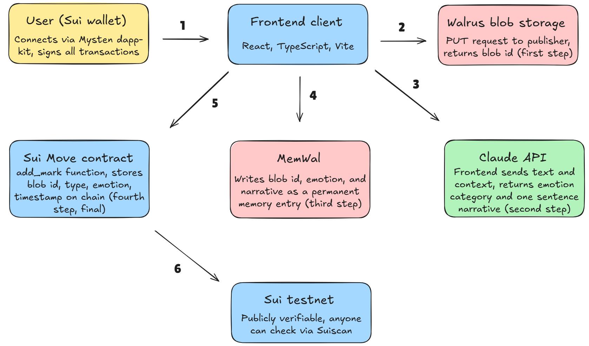

# IWAS

A wall where people leave marks. You write a text or draw a picture, and it gets stored permanently on the Walrus network.

### Links

- **Live site:** [iwas.app](https://iwas.app)
- **GitHub:** [GokhanCey/iwas](https://github.com/GokhanCey/iwas)
- **X (Twitter):** [@gokhanceylan](https://x.com/gokhanceylan)

### How it works

Walrus stores the marks as permanent data blobs. Every time a mark is left, IWAS AI (Claude) reads it to understand the emotion behind it. MemWal remembers these emotions across sessions. The Wall pulls everything together into a collective canvas. A Sui smart contract indexes every mark globally so strangers can see each other's marks.

### Architecture



### Stack

React / TypeScript / Sui / Walrus / MemWal / Claude API

### Setup

```env
VITE_CLAUDE_API_KEY=
VITE_MEMWAL_PRIVATE_KEY=
VITE_MEMWAL_ACCOUNT_ID=
```

get your MemWal credentials at app.memwal.com and your Claude API key at console.anthropic.com

### Smart contract on Sui

Package ID: `0xc8d3c0e185b06d4f219ba68c3cff8299be869ac515dbf3e98fa80e23257beee8`  
Wall Object ID: `0xa9b8f6be4757fe9cbb5ca714d28f4d1416ad3772e6337432ef7a8f6652a229f6`

### How we used the stack

**Walrus:** every mark is stored as a blob on Walrus testnet. the blobId is the mark's permanent identity. nothing gets deleted. expired text blobs naturally "fade" into eroded memories on the wall.

**MemWal:** after IWAS AI reads a mark, the emotion and narrative get written to MemWal. this makes the semantic memory permanent and indexable.

**IWAS AI:** the frontend sends the mark to Claude, which returns one emotion out of seven and one poetic narrative sentence. the output gets committed to MemWal alongside the blob. nothing is mocked.

**Sui:** a Move smart contract indexes every mark on-chain. the wallet signs a transaction on every upload. the wall is global.

### Run locally

```bash
npm install
npm run dev
```

### Why it exists

Most of the internet is built for scrolling and forgetting. We wanted to make a place where you leave a piece of yourself and walk away. It is an experiment in digital permanence. Decentralized storage doesn't have to feel like a database. It can feel like a cave wall.
